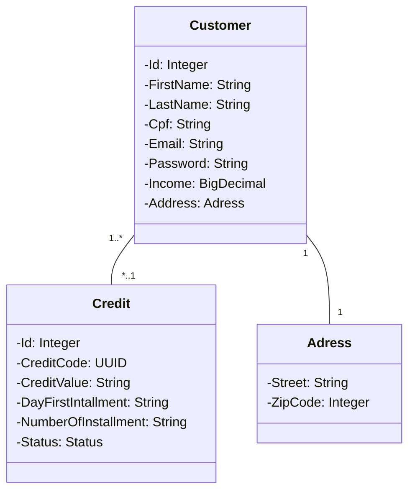

# customer-credit
## Aplicação desenvolvida em Kotlin + Spring Framework
## Aplicação para um sistema capaz de fornecer crédito a um cliente.
### Testes integrados e unitários mal desenvolvidos ( necessário um estudo aprofundado )

